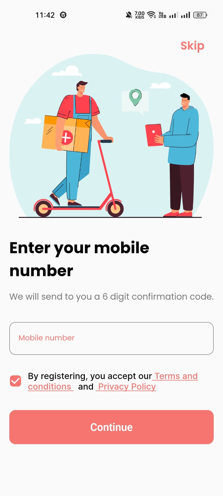
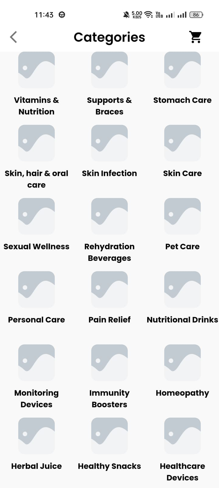
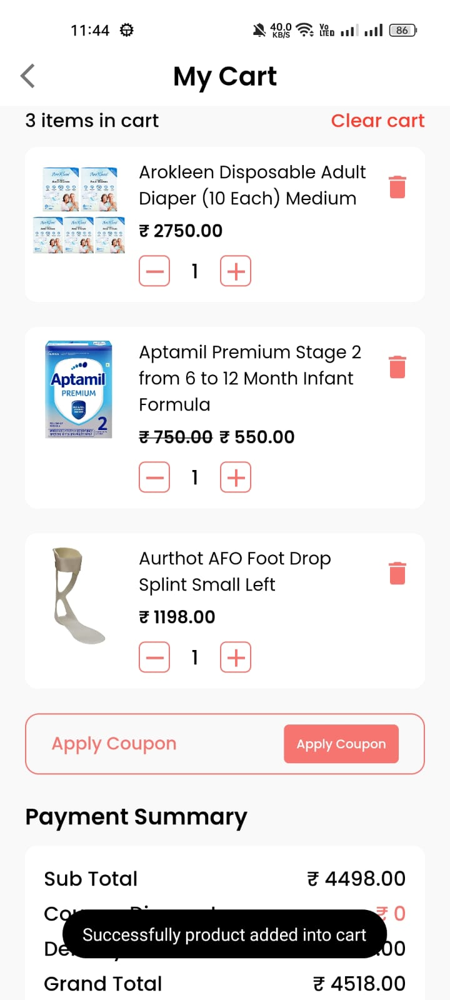

# 💊 FirstDose – Medicine Delivery App

FirstDose is a Flutter-based cross-platform mobile application designed to simplify and enhance how users access medicines and healthcare products. Built with speed, convenience, and user experience in mind, the app allows users to order medications, upload prescriptions, and explore healthcare essentials—all in one place.

## 🧠 Abstract

The FirstDose project offers a unified mobile platform that blends medicine discovery, healthcare product exploration, and a streamlined ordering experience. With intuitive search, three flexible delivery options (10-minute superfast, 24-hour, and 2-day delivery), and real-time updates, FirstDose delivers a hassle-free experience to manage your healthcare needs.

## 🚀 Features

- 🔒 **User Authentication** – Sign-up/login using secure credentials.
- 🧾 **Upload Prescription** – For custom medicine orders.
- 🛍️ **Medicine Search & Cart** – Browse or search products and add to cart.
- 🚚 **3 Delivery Options** – Superfast (10 mins), Standard (24 hrs), Extended (2 days).
- 📦 **My Orders** – Track current and past orders.
- 🛒 **Integrated Shop** – Purchase wellness products, vitamins, and personal care items.
- 📈 **Order History & Favorites** – Save and reorder your essentials quickly.
- 🔁 **Smart Recommendations** – Based on past orders and prescription history.

## 🛠️ Tech Stack

- **Frontend:** Flutter (Dart)
- **Backend:** REST APIs
- **Authentication & DB:** Firebase
- **Payment Gateway:** Stripe
- **Project Tools:** Trello, Slack, Postman
- **Data Analysis:** Python (Pandas, Matplotlib)

## 🧪 Testing

✔️ Unit Testing  
✔️ Integration Testing  
✔️ Functional Testing  
✔️ User Acceptance Testing

## 📸 Screenshots

| Sign Up | Sign In |
|--------|--------|
|  |  |

| Home Page | My Orders |
|-----------|-----------|
|  |  |

| Categories | Cart |
|-----------|------|
|  |  |


## 🧩 Installation Guide

```bash
# Clone the repository
git clone https://github.com/yourusername/FirstDose.git

# Navigate to the project directory
cd FirstDose

# Install dependencies
flutter pub get

# Run the app
flutter run
```

## 📈 Future Scope

- AI-powered medicine suggestions
- Teleconsultation & e-prescription support
- Geo-expansion to rural areas
- Subscription plans for regular medicines
- Health tracking dashboard and reminders

## 📄 License

This project is licensed under the [MIT License](LICENSE).


## 👨‍💻 Developed By

**Shivang Gaur**  

